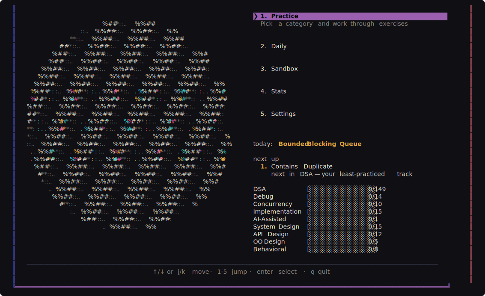
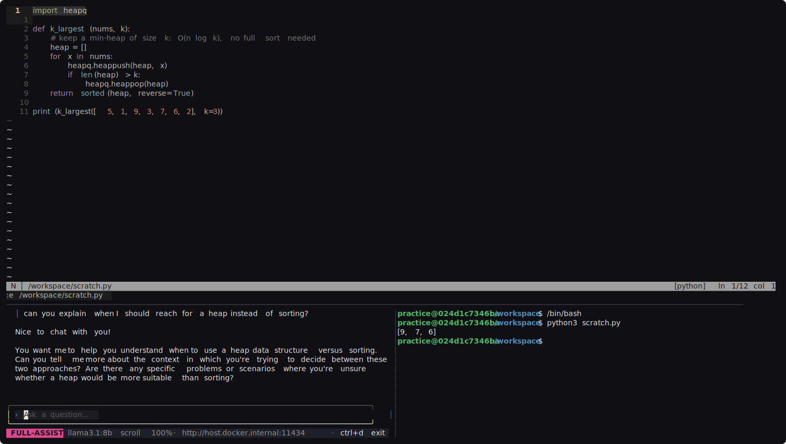

# Ballroom

A terminal app for technical-interview practice: coding exercises with
hidden tests, system-design and behavioral mock interviews with an LLM
interviewer, and an in-session AI tutor — all running locally in a
Docker practice environment.

<p align="center"></p>

<p align="center"></p>

Every session is a tmux window with three panes: the problem statement
and your editor (nvim) on top, the tutor chat and a terminal below.
You write real code (or a real design doc), submit against hidden
tests (or a hidden grading rubric), and the result lands in a local
progress tracker.

## Requirements

- Docker (the practice environment is a container; the image builds
  itself on first launch)
- Go 1.25+ (to build the CLI)
- An LLM for the tutor — either of:
  - [Ollama](https://ollama.com) running locally (default model
    `llama3.1:8b`), or
  - an [OpenRouter](https://openrouter.ai) API key for hosted models

## Install & run

```sh
go build -o ballroom ./cmd/ballroom
./ballroom
```

The first launch runs boot checks (Docker daemon, practice image —
built automatically — Ollama, tutor model) and lands on the home menu:
**Practice** (pick a category and problem), **Daily** (today's pick,
one keypress), **Sandbox** (ungraded scratch environment), **Stats**
(progress, recent attempts, rubric and coding weak spots),
**Settings** (models, default language, tutor notes).

### Configuring the tutor models

Through Settings in the TUI, or directly:

```sh
ballroom config set-model llama3.1:8b                    # local Ollama
ballroom config set-model openrouter:<model-slug>        # hosted
ballroom config set-key <openrouter-api-key>
ballroom config set-orchestrator-model <tag|none>        # optional routing model
ballroom config set-grader-model <tag|none>              # optional dedicated grader
```

The tutor needs a model with **real tool-calling support** (the model
picker probes and shows a "(no tools)" badge next to models that
can't). Models that only narrate tool calls as text get a degraded
JSON-fallback mode; models with native support get the full agent,
and OpenRouter models stream their replies progressively.
`TUTOR_STREAM=on|off` overrides streaming per invocation.

## The tracks

**Coding** — DSA (the NeetCode 150, by topic), debugging, and
OO-design exercises in Python, Go, and C++. Hidden tests are mounted
only when you submit: the visible starter must fail them, your job is
to make them pass. Every NeetCode problem links its official solution
video (a spoiler-marked footer on the problem statement, and again
with your results).

**Concurrency** — a ten-rung ladder (bounded queues, worker pools,
barriers, graceful shutdown, a deadlock to fix) in all three
languages, with hidden tests running under the race detector
(`go test -race`) and ThreadSanitizer — "it usually works" never
passes. Curriculum: `docs/concurrency-roadmap.md`.

**Implementation** — eleven build-it-from-scratch components: rate
limiters, a bloom filter, a consistent-hash ring, a TTL cache, retry
with backoff, plus a parsers half (tokenizer, glob matcher, INI and
JSON parsers, event emitter). Injectable clocks make every test
exact. Curriculum: `docs/implementation-roadmap.md`.

**System design** — the
[system-design-primer](https://github.com/donnemartin/system-design-primer)
questions as guided **coach** sessions (the 4-step method, one step at
a time) and timed **interviewer** mocks (bare prompt, you scope it,
45 minutes). A hidden per-question rubric grades your `solution.md`
on submit, and most questions link a curated walkthrough video.
`docs/system-design-roadmap.md` is the full curriculum, start there.

**Behavioral** — eight classic "tell me about a time…" questions as
**story-coach** sessions (build a STAR answer one section at a time)
and timed interviewer mocks. Graded against STAR rubrics: situation
specificity, stakes, ownership, evidence, reflection.

## The practice loop

1. Pick a problem (or press `2` for **Daily** — a date-stable pick
   among due and unsolved problems). The picker searches as you type,
   long categories scroll, and every row carries its `[E]`/`[M]`/`[H]`
   difficulty badge.
2. Work in the session; talk to the tutor as much as the mode allows
   (coding exercises choose syntax-only / hints-first / full-assist
   per exercise; design and behavioral sessions choose coach or
   interviewer per session).
3. Submit with `M-q`. Coding: hidden tests run, and a green run ends
   with a complexity quiz — state your time/space complexity and the
   grader model checks it against your actual code.
   Design/behavioral: the rubric (and, for solved primer questions, a
   reference design) appears in your workspace and the grader model
   grades your solution dimension by dimension — pass/fail plus a
   summary, both recorded.
4. Every submit ends with a model-written recap of the session —
   what you attempted, what the tutor conversation got stuck on, how
   it ended — appended to the attempt's notes (your own note comes
   first, untouched). The full tutor conversation also survives:
   `transcript.md` in the workspace during the session, and a copy
   under `data/transcripts/` afterward.
5. The picker resurfaces what needs attention: **mock due** (coach
   pass whose interviewer mock is untouched), **review due** (a
   failure ≥3 days old, or anything solved but untouched for 30
   days) — due problems float to the top.
6. **Stats → Rubric weak spots** ranks the rubric dimensions you keep
   losing points on; when one keeps showing up, that's your next
   study block.

## Inside a session

| Key | Action |
|---|---|
| `M-1` / `M-2` / `M-3` | jump to editor / tutor / terminal pane |
| `Ctrl-Tab` | cycle panes |
| `M-q` | submit (pre-types the command; Enter confirms) |
| `M-0` | leave the session and return to the picker (y/n confirm) |
| `M-h` | toggle tutor highlights in the editor |
| `Ctrl-D` (tutor pane) | exit the tutor chat |

Timed sessions show a countdown clock at the right of the status bar
(gold under 10 minutes, red past time). The tutor pane scrolls with
PgUp/PgDn or the mouse wheel, renders code as editor cards, and shows
the tools the model calls in real time. Estimation help for design
sessions: `less ~/back-of-envelope.md` in the terminal pane.

The tutor pane reads like a modern terminal-agent chat: your messages
carry a pink accent bar, replies render markdown (lists, quotes,
links) with code as bordered editor cards, tool calls settle into
one-line summaries, and the input sits in a rounded box above a
status bar — mode pill, model, hints count (hints-first), scroll
position, and the exit hint.

**Voice input**, two ways (the container never needs mic access):

- Zero setup: macOS built-in dictation types straight into the tutor
  pane — press the dictation shortcut (default: `fn` twice) with the
  pane focused and speak.
- `ballroom voice` (run on the host while a session is active):
  records until you press Enter, transcribes locally with
  whisper-cpp, and types the text into the tutor pane for you to
  review and send. Needs `brew install ffmpeg whisper-cpp`; the
  ~142 MB model downloads on first use after an explicit yes.
  `--from-wav <file>` transcribes an existing recording.

## Development

```sh
go test -race ./internal/...   # unit/integration tests (mocked providers)
go vet ./cmd/... ./internal/...
go run ./cmd/verify-exercises  # structural check of every exercise
go run ./cmd/tutor-preview     # tutor pane on canned fixtures, no network
go run ./cmd/tutor-eval        # live model-behavior eval (needs Ollama; slow)
```

Exercises and hidden tests live on the host (`exercises/`, `tests/`)
and need no image rebuild to change. Changes to `cmd/`, `internal/`,
or `docker/` are picked up by the boot screen's image build on the
next launch, or rebuild manually:

```sh
docker build -f docker/Dockerfile -t ballroom-practice .
```
